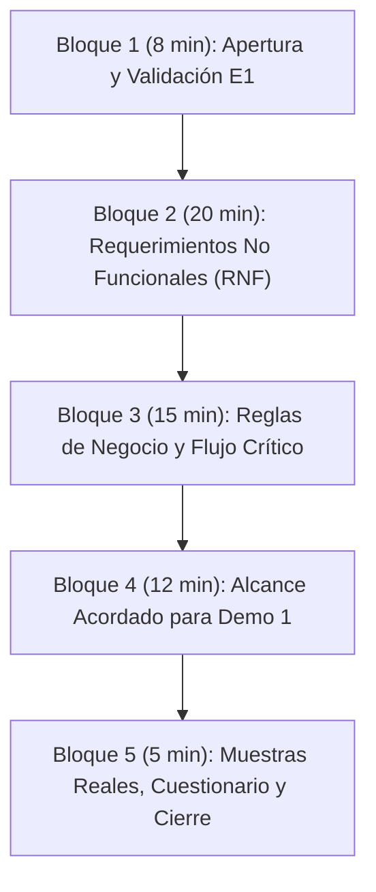

# Entrevista 2 — Planificación, Guión y Requerimientos (Demo 1 y Entrega 1)

## 1. Ficha Técnica del Encuentro

- **Fecha y hora:** Lunes 14 de Septiembre de 2026, 17:00 hs (Presencial, Facultad de Informática - UNLP).
- **Entrevistado:** Martín Rodríguez (`@ruso` en rol de Responsable de Planificación Logística y Rutas).
- **Equipo Consultor:** **Softech** (estricto rol corporativo; sin menciones académicas ni de grupo frente al cliente).
- **Duración prevista:** 50 a 60 minutos.
- **Canal de comunicación previo:** Discord (`@ruso`).
- **Materiales previos entregados:** Paquete `Entrevista1.zip` (Minuta ejecutiva `Resumen_Entrevista1.pdf` y grabación `Audio_Entrevista1.m4a`).

---

## 2. Marco Estratégico y Alineación con el Cronograma

Esta entrevista es el **hito bisagra de la etapa de relevamiento**. Según el cronograma oficial de la materia:

```
[14/09] Entrevista 2 (ÚLTIMA ENTREVISTA)
   │
   ▼ (7 días)
[21/09] ENTREGA 1: Entrevistas + Cuestionario + Requisitos No Funcionales (RNF)
   │
   ▼ (14 días)
[05/10] ENTREGA 2: Iniciativas + Épicas + Historias de Usuario (HU) + PGP
   │
   ▼ (Sprint 1: 09/10 al 30/10)
[30/10] DEMO 1: Demostración Funcional en Vivo del MVP
```

> [!IMPORTANT]
> **Esta es la última entrevista presencial con Martín antes de la Entrega 1 y del inicio del desarrollo para la Demo 1.**  
> Por ello, el encuentro debe cumplir dos metas simultáneas:
> 1. **Para la Entrega 1 (21/09):** Extraer con absoluta precisión los **Requerimientos No Funcionales (RNF)** (rendimiento, seguridad, disponibilidad/offline, dispositivos, volumen y usabilidad) y coordinar el **Cuestionario**.
> 2. **Para la Demo 1 (30/10):** Delimitar el alcance exacto del MVP para mostrar un flujo funcional completo de punta a punta (carga de ruta, app móvil del chofer con cobro y foto de remito, y panel administrativo de conciliación).

---

## 3. Dinámica y Roles del Equipo Softech

Para optimizar el tiempo de la reunión, se distribuyen los roles:
- **Interlocutor Principal (Moderador):** Conduce la entrevista, presenta los temas, formula las preguntas abiertas y mantiene el hilo de la conversación.
- **Interlocutor Secundario (Foco Técnico / RNF):** Interviene puntualmente para profundizar en detalles de arquitectura, conectividad, dispositivos y excepciones.
- **Transcriptores (2 integrantes):** Toman nota exhaustiva y textual de respuestas, bifurcaciones, números exactos y comentarios al margen.
- **Observador / Gestor del Tiempo (Timekeeper):** Controla el reloj para asegurar que no queden bloques sin cubrir en los 60 minutos.

---

## 4. Estructura y Guión de la Entrevista (Timeboxing)



---
### Extra: ver donde poner:
- Preguntar si desde la plataforma el transportista tiene que ver el remito digital antes de finalizar ocn la entrega, o si el mismo transportista tiene que subir una foto solo una vez que tenga el remito físico firmado.
- Consultar por la parte administrativa, el sistema debe estar preparado para ellos también? Hacer un tipo de usuario para cada rol.
- Preguntar desde que momento quiere registrar, si desde el centro de acopio en adelante o empezar antes, desde la parte central de la empresa? Preguntar como se analiza la logistica desde la marca hasta el centro de acopio.
- Preguntar cuantos tipos de usuario va a haber y de que forma interactuan con el sistema (nosotros pensabamos en transportista, administrativo y quizas superusuario). Desde que plataforma ingresa cada rol (pc, celular, etc).


---
### Bloque 1: Apertura y Validación Rápida de la Entrevista 1 (8 minutos)

**Objetivo:** Confirmar que la minuta fue clara, validar premisas operativas y evitar repetir lo ya acordado.

- **Pregunta 1.1:** *«Martín, pudiste revisar la minuta ejecutiva que te enviamos junto con el audio? ¿Hay alguna discrepancia o aspecto que consideres necesario ajustar sobre lo conversado en la primera reunión?»*
- **Pregunta 1.2 (Confirmación de premisas base):**
  *«Queremos revalidar rápidamente las dimensiones de la operación: 35 partidos de zona sur, 6 centros logísticos, 200 camiones, 300 transportistas y 10 administrativos. ¿Siguen siendo estas las cifras de referencia para dimensionar el sistema?»*
   - Mejor poner como punteo y no como pregunta.
- **Pregunta 1.3 (Exclusiones de alcance):**  
  *«Confirmamos también que los comercios minoristas y los clientes finales no tendrán acceso directo a la plataforma, y que no se contempla rastreo satelital GPS ni reemplazo del remito físico legal. ¿Es correcto?»*
   - Estaría bueno preguntar esto, y si cambia algo no contradecirlo sino decirle «Perfecto, anotamos esa modificación / añadimos esa característica».
   - No complicarnos ampliando demasiado el alcance. Si hay algo que no podemos hacer, debemos decirle que eso puede quedar para una ampliación posterior del sistema.

- **Conceptos recolectados hasta el momento:** *«Bueno Martín, nosotros teníamos pensado ... ¿qué opinas sobre esta solución?¿Hay algo que quieras agregar antes de pasar al resto de las preguntas?»*


---

### Bloque 2: Requerimientos No Funcionales (RNF) — Eje para Entrega 1 (20 minutos)

> [!TIP]
> Este bloque suministra el insumo directo para la **Sección 3 de la SRS (SRS + PGP)** de la Entrega 1 del 21/09. Cada pregunta apunta a una métrica verificable.

#### RNF-01: Disponibilidad y Conectividad (Modo Offline en Calle)
1. **Calidad de señal:** *«En los 35 partidos del conurbano donde operan los camiones, ¿es habitual que los choferes ingresen a zonas sin señal móvil (sótanos, almacenes en zonas rurales o de baja cobertura)?»*
2. **Operatoria Offline:** *«Si el transportista no tiene conexión a internet al llegar al comercio, ¿la aplicación debe permitirle registrar la entrega, sacar la foto del remito y registrar el pago en forma 100% local, para luego sincronizar automáticamente cuando recupere señal o llegue al centro de acopio?»*
   - Esto lo descartamos por ahora.
3. **Manejo de conflictos:** *«Si una sincronización falla o se interrumpe a mitad de camino, ¿qué tolerancia se espera? ¿El chofer debe ver un indicador visual claro (ej. "3 entregas pendientes de sincronizar")?»*

#### RNF-02: Plataforma, Dispositivos e Interfaces de Hardware
1. **Tipo de dispositivos:** *«¿Los celulares utilizados por los 300 transportistas son provistos por la empresa o son sus teléfonos personales (BYOD)?¿Los choferes disponen de plan de datos corporativo ilimitado?»*
   - Tener en cuenta el uso de celulares más viejos para el desarrollo.
2. **Sistema Operativo:** *«¿Qué plataforma debemos soportar de forma prioritaria? ¿Son todos teléfonos Android o hay choferes que utilicen iPhone (iOS)? ¿Qué versión mínima de Android consideran aceptable?»*
#### RNF-03: Rendimiento, Volumen y Concurrencia
1. **Pico de concurrencia:** *«¿En qué horarios se concentra la mayor actividad simultánea? (Ejemplo: salida matutina 4:00-9:00 AM para descargar hojas de ruta, y tarde 14:00-18:00 hs para rendición y sincronización de entregas).»*
2. **Volumen de transacciones:** *«En un día de máxima actividad o temporada alta, ¿cuántos remitos y cobros procesa en total la flota? (Estimación: 200 camiones × ~30 paradas = ~6.000 a 10.000 operaciones diarias).»*

#### RNF-04: Seguridad, Integridad y Auditoría
1. **Gestión de accesos y pérdida de dispositivos:** *«¿Cómo deben autenticarse los transportistas (usuario/contraseña, PIN numérico rápido de 4 dígitos)? Si a un transportista le roban o extravía el celular durante el reparto, ¿la administración debe poder revocar su sesión de inmediato?»*
2. **Auditoría de diferencias en arqueo:** *«Cuando un administrativo detecta una diferencia en el dinero y realiza un ajuste o corrección manual, ¿el sistema debe exigir un motivo obligatorio y registrar quién, cuándo y qué valor modificó?»*  
   - Quizas es medio obvio pero considerar.
3. **Resguardo legal y retención de datos:** *«El remito físico se guarda 5 años por ley. Para las fotografías digitales de remitos y comprobantes de transferencias en el sistema, ¿cuál es el plazo mínimo de conservación en los servidores?»*

#### RNF-05: Usabilidad y Condiciones Ambientales
1. **Entorno de uso en cabina:** *«Los choferes operan en la vía pública, a menudo con luz solar directa, apurados o con guantes. ¿Prefieren una interfaz de alto contraste, tipografías y botones grandes, y flujo lineal de un solo clic por acción?»*
2. **Curva de aprendizaje:** *«¿Qué nivel de afinidad tecnológica tienen los 300 transportistas? ¿Se requiere que la app funcione casi como un formulario guiado sin menús complejos?»*
3. **Imagen de marca:** *«Hay algun color, imagen o recurso grafico que deba respetarse en la aplicación?»*

---

### Bloque 3: Reglas de Negocio y Flujo Crítico (15 minutos)

#### 3.1. Hoja de Ruta y Orden de Paradas
- *«¿El chofer necesita ver en cada parada el detalle fino de artículos (cajones de gaseosas, packs) o únicamente el importe a cobrar, el nombre del comercio y el medio de pago establecido?»*
   - El chofer sí lo verifica pero no es necesario el detalle en la implementación del sistema, solo el monto y la localización del comercio.

#### 3.2. Circuito de Cobranzas y Validación de Pagos
- **Efectivo:** *«Al cobrar en efectivo, el chofer recibe el dinero físico. En la app, ¿solo tipea el monto recibido? Al finalizar el día en el centro de acopio, ¿a quién entrega físicamente el sobre/bolsa con el dinero recaudado y cómo se valida que coincida con lo registrado en la app?»*
   - Diría que solo el monto, o a lo sumo si hubo un problema se comunica la empresa con el comercio en cuestión.
- **Transferencias bancarias:** *«Cuando el almacenero paga por transferencia: ¿a qué cuenta transfiere (a una cuenta única de la distribuidora o a cuentas individuales por chofer/marca)? ¿Es obligatorio que el chofer adjunte una foto del comprobante o tipee el número de transacción bancaria para que la administración lo concilie después?»*
 - Hay una serie de cuentas de la empresa. Los datos de la cuenta que maneja el transportista deben estar asentados en algún lado.
 - Consultar la segunda pregunta en E2.
- **Pagos combinados y diferencias:** *«¿Ocurre que un cliente pague una parte en efectivo y otra parte por transferencia? ¿O que pague de menos por falta de cambio? ¿Cómo debe contemplarlo el sistema?»*
 - Puede ocurrir, hay que preguntarlo. Consideramos que se deje un saldo a favor.
- **Cobro con QR (Mercado Pago / Modo):** *«A futuro se proyecta QR. Para el MVP actual, ¿el cobro con QR requiere integración bancaria automática en tiempo real, o bastará con que el chofer registre el código de comprobante de la transacción de la billetera?»*
 - Que el sistema esté preparado para la posibilidad.

#### 3.3. Contingencias y Reentrega Automática
- *«Si un comercio está cerrado, no tiene el dinero o no hay responsable: ¿cuáles son los motivos estándar que debe mostrar el menú desplegable (múltiple choice) en la app? (Ejemplos: Local cerrado, Falta de fondos, Mercadería rechazada por avería, Dirección inaccesible).»*
- *«Al marcar un inconveniente no imputable al camión, ¿el sistema debe reprogramar la visita automáticamente para la hoja de ruta del día siguiente, o requiere aprobación previa de un supervisor administrativo?»*


-- Muy inusual, no debemos considerarlo.
---

### Bloque 4: Delimitación del Alcance para la Demo 1 (12 minutos)

> [!IMPORTANT]
> El **30 de Octubre** se presenta la **Demo 1** ante la cátedra y el cliente. Debemos acordar con Martín el "Happy Path" exacto que se demostrará funcionando.


Diríamos de no adelantarnos tanto, simplemente preguntar, si queda tiempo, el alcance de un mvp (o alguna preguntita basica al respecto).

---

### Bloque 5: Muestras Reales, Cuestionario y Cierre (5 minutos)

1. **Solicitud de documentación de muestra (anonimizada):**
   - *«Para garantizar que el modelo de datos coincida al 100% con su realidad operativa, ¿sería posible que nos faciliten una copia o fotografía (con datos confidenciales tachados) de:»*
     - Una hoja de ruta real de un día típico.
2. **Cuestionario complementario:**
   - *«De cara a la entrega del 21/09, tenemos previsto confeccionar un breve cuestionario estructurado (5 a 10 preguntas) dirigido a transportistas y administrativos sobre hábitos de uso de celulares y detalles de cobros. ¿Nos autorizás a coordinarlo con vos para hacérselo llegar?»*
3. **Agradecimiento y formalización del cierre:**
   - Resumen verbal de los compromisos adquiridos.
   - Aviso de que se enviará la minuta de esta segunda entrevista por Discord a la brevedad.

---

## 5. Matriz de Requerimientos a Consolidar post-Entrevista 2

Esta tabla servirá a los transcriptores y al equipo técnico para volcar los resultados directamente en la **SRS de la Entrega 1 (21/09)** y en las **Épicas e Historias de Usuario de la Entrega 2 (05/10)**:

| Código | Tipo | Requerimiento / Aspecto a Cerrar | Criterio de Aceptación Preliminar | Estado E2 |
| :--- | :---: | :--- | :--- | :---: |
| **RNF-01** | RNF | Funcionamiento Offline en App Móvil | Permite registrar entregas, fotos y cobros sin conexión; sincroniza sin duplicados al reconectar. | Por validar |
| **RNF-02** | RNF | Compatibilidad de Plataforma Móvil | Soporte en dispositivos Android 10+ con uso eficiente de memoria y cámara. | Por validar |
| **RNF-03** | RNF | Concurrencia y Capacidad | Capacidad para soportar 300 transportistas y hasta 10.000 transacciones diarias concurrentes. | Por validar |
| **RNF-04** | RNF | Seguridad y Auditoría de Arqueos | Registro inmutable de cada cobro y log de auditoría obligatorio ante ajustes manuales en conciliación. | Por validar |
| **RNF-05** | RNF | Usabilidad en Ruta | Interfaz simplificada de alto contraste con botones grandes y flujo guiado de máximo 3 toques. | Por validar |
| **RF-01** | RF | Visualización de Hoja de Ruta Diaria | El transportista visualiza sus paradas del día con orden libre de ejecución. | Pre-validado |
| **RF-02** | RF | Registro de Entrega con Foto Obligatoria | No se puede marcar entrega exitosa sin adjuntar al menos una fotografía del remito firmado. | Pre-validado |
| **RF-03** | RF | Tipificación de Contingencias y Reentrega | Selección múltiple choice de causas de no entrega y programación automática para el día siguiente. | Por validar |
| **RF-04** | RF | Registro de Cobranzas Bimodal (Efectivo/Transf.) | Registro de efectivo recibido y código/foto de comprobante en transferencias. | Pre-validado |
| **RF-05** | RF | Panel Administrativo de Conciliación | Comparación automática entre importes facturados por remito y fondos rendidos por chofer/marca. | Pre-validado |


## RNF que no anotamos todavía

- Que una persona solo pueda tener un único usuario, para que no haya problemas al tener que trackear más de un usuario para una sola persona.
- Asegurar la consistencia de transacciones (en concepto de base de datos).
- El software debe permitir agregar rápidamente nuevos comercio, camiones o choferes desde el panel administrativo.
- El sistema debe poder implementar cobro por QR (modo).
- Opcion de acceso a la camara.
- Formato de la hoja de ruta. 
- Entidad bancaria que tiene las cuentas.


## RF
- Registro de pago exacto en el momento de la entrega.
- Identificar el dispositivo que se conecta para .
- Alerta en la parte administrativa en caso de error o conflicto.