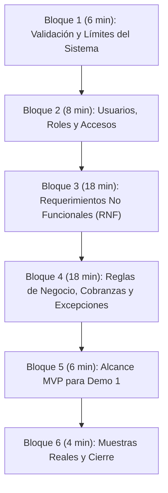

# Entrevista 2 — Guión de Preguntas y Relevamiento de Requerimientos

## 1. Ficha Técnica del Encuentro (Formato Oficial de Cátedra)

- **Proyecto:** Sistema de Gestión Logística, Distribución y Conciliación de Cobranzas
- **Empresa Consultora:** **Softech**
- **Fase del Proyecto:** Relevamiento de Requerimientos y Definición de Alcance (Previo a Entrega 1 y Demo 1)
- **Modalidad / Lugar:** **Virtual por Discord** (Llamada en servidor de la materia con `@ruso`)
- **Fecha y Hora:** Lunes 14 de Septiembre de 2026 — 17:00 hs
- **Duración prevista:** 50 a 60 minutos
- **Entrevistado:** Martín Rodríguez (`@ruso` en rol de Responsable de Planificación Logística y Hojas de Ruta)
- **Documentos de referencia previa:**
  - Minuta ejecutiva: `Resumen_Entrevista1.pdf` (enviado en `Entrevista1.zip`)
  - Audio de respaldo: `Audio_Entrevista1.m4a`
  - Plantilla base de entrevista: `Entrevista - Plantilla.pdf`
- **Objetivos de la entrevista:**
  1. Validar el flujo operativo relevado y afinar los límites del sistema.
  2. Extraer los **Requerimientos No Funcionales (RNF)** con métricas cuantitativas para la **Entrega 1 (21/09)**.
  3. Profundizar en las reglas de negocio de cobranzas, excepciones y hojas de ruta.
  4. Acordar el alcance prioritario del MVP para la **Demo 1 (30/10)**.
  5. Solicitar una hoja de ruta de muestra y coordinar el envío de un cuestionario complementario.

---

## 2. Pautas Operativas para el Equipo Softech en Discord

> [!IMPORTANT]
> - **Identidad estricta:** Hablamos 100% como **Softech** frente a Martín. No se menciona "Grupo 7", ni número de grupo, ni materias ni profesores.
> - **Manejo de pedidos fuera de alcance:** Si Martín sugiere una funcionalidad compleja (ej. rastreo satelital por GPS en vivo, ruteo automático por IA o integraciones bancarias automáticas), no contradecirlo de forma tajante; responder: *«Perfecto Martín, lo dejamos registrado como una ampliación para una fase posterior, priorizando ahora el núcleo operativo de entregas y conciliación»*.
> - **Roles en la llamada:**
>   - **Moderador / Interlocutor:** Conduce el orden de los bloques y lee las preguntas de forma fluida y natural.
>   - **Transcriptores (en simultáneo):** Completan el campo `[Respuesta:]` debajo de cada pregunta en este mismo archivo o en sus notas compartidas.

---

## 3. Cuerpo de la Entrevista

---

### Bloque 1: Apertura, Validación Rápida y Límites del Sistema (6 minutos)

*Objetivo: Validar que la minuta de la Entrevista 1 refleja la realidad y confirmar desde dónde hasta dónde opera el software.*

#### 1.1. Recepción y revisión de la Minuta E1
> *«Buenas tardes Martín, gracias nuevamente por tu tiempo. ¿Pudiste darle una mirada al resumen y al audio que te enviamos por acá? ¿Considerás que refleja con fidelidad lo conversado en nuestro primer encuentro o hay algún detalle que quieras precisar?»*
- **[Respuesta:]**
	Miro el resumen, el audio no lo escuchó. Considera que no es contradictorio con lo que hablamos, aclara que los horarios de carga y descarga no son fijos (están establecidos pero pueden llegar a modificarse)
	Comentamos que este punto se va a hablar con profundidad mas adelante en la entrevista

#### 1.2. Punteo rápido de confirmación dimensional
> *«Retomando con lo discutido en la primera entrevista, tomamos como referencia operativa: 35 partidos de la zona sur, 6 centros de acopio, una flota de 200 camiones, un equipo de 300 transportistas y 10 empleados administrativos dedicados a rutas y conciliación. ¿Hasta ahí vamos bien?»*
- **[Respuesta:]**
	Esta de acuerdo con el resumen
#### 1.3. Punto de inicio del sistema en la cadena logística
> *«Respecto a la logística: el sistema que vamos a desarrollar, ¿comienza a operar desde que la mercadería ya se encuentra en el centro de acopio y se diagraman las salidas a los comercios barriales (última milla), o necesitan registrar también el traslado previo desde las fábricas de las marcas matrices hacia el depósito?»*
- **[Respuesta:]**
	Únicamente requiere el traslado desde los centros de acopio a los comercios

#### 1.4. Exclusiones confirmadas de alcance
> *«Revalidamos que los comercios minoristas y los clientes finales no van a tener acceso directo al sistema (solo interactúan con el chofer en el mostrador) y que el remito físico en papel se conserva de manera legal obligatoria. ¿Es así?»*
- **[Respuesta:]**
	Efectivamente, aprueba
#### 1.5. Modificaciones con respecto a lo charlado previamente
> *«Con esto terminamos de sintetizar lo que charlamos previamente. ¿Hay algo que quieras modificar o agregar antes de pasar al resto de las preguntas?»*
- **[Respuesta:]**
	No preguntamos

#### 1.6. Cierre de la idea inicial
> *«Perfecto Martín. Te comentamos lo que pensamos implementar hasta el momento:* 
 - *una plataforma móvil para transportistas en la cual se puedan agregar la información y documentaciones correspondientes a cada entrega, incluyendo dirección del comercio, foto de remito firmado y factura, y donde se pueda cargar los datos de pago.*
 - *una plataforma de escritorio para la parte administrativa en la que puedan cargar los datos que necesiten los transportistas (cada entrega con su hoja de ruta y demás)».*
- **[Respuesta:]**
	Hace énfasis en que quiere tener control sobre los remitos entregados, las hojas de ruta unicamente indican los lugares que se van a visitar pero hay situaciones en las que tiene que entregar varios remitos en la misma dirección
	El grueso de la operatoria se realiza con muchos remitos, los cuales se imprimen (700 remitos aprox)

---

### Bloque 2: Usuarios, Roles y Plataformas de Acceso (8 minutos)

*Objetivo: Tipificar los perfiles de usuario, definir desde qué dispositivos ingresan y los controles de acceso.*

#### 2.1. Tipos de roles en la empresa
> *«Nosotros identificamos principalmente dos roles operativos: el **Transportista** (en calle) y el **Personal Administrativo** (en base). ¿Existe algún otro rol que deba contemplar el sistema, por ejemplo un Supervisor de depósito, Jefe de logística o un Administrador general del sistema con permisos especiales?»*
- **[Respuesta:]**
	No hay que contemplar otro rol, los transportistas tienen siempre las mismas tareas
	Administrativos: 
-	Algunos validan cobros y no cargan rutas o viceversa
	quieren que los administrativos tengan distintos permisos
	

#### 2.2. Plataformas de acceso por rol
> *«¿Está previsto que el personal administrativo trabaje exclusivamente desde computadoras de escritorio / notebooks en el centro de acopio, y que los transportistas utilicen exclusivamente la aplicación en sus teléfonos celulares durante el reparto?»*
- **[Respuesta:]**
	El transportista trabaja con un telefono encima
	El administrativo probablemente no trabaje desde un celular por el volumen de información a visualizar
	Validar 

#### 2.3. Unicidad de cuentas y altas/bajas de personal
> *«Dado que hay rotación de choferes y vehículos: ¿cada transportista debe tener un usuario único e intransferible (para evitar confusiones de quién cobró qué dinero)? ¿El panel administrativo debe permitir dar de alta, pausar o deshabilitar rápidamente a un chofer o camión?»*
- **[Respuesta:]**
	Cada transportista debe tener una única cuenta
	El panel debe cumplir con las operaciones de dar de alta, pausar o deshabilitar
	Contraseñas: Tener forma de recuperar contraseñas, dado que si se la olvidan el transportista no puede trabajar

---

### Bloque 3: Requerimientos No Funcionales (RNF) 

*Objetivo: Extraer métricas técnicas medibles.*

#### 3.1. RNF de Dispositivos, Plataforma e Interfaces de Hardware
> **P3 (Teléfonos y gama):** *«Los celulares que usan los 300 transportistas, ¿son equipos personales de cada uno o los provee la empresa? ¿Son todos con sistema Android? ¿Debemos considerar compatibilidad con teléfonos de gama media o modelos más antiguos?»*
- **[Respuesta:]**
	Los celulares son de los transportistas, en la experiencia los celulares dados por la empresa para comunicarse entre ellos tuvieron malas experiencias. Los transportistas usan celulares viejos (propios de cada transportista pero separados de sus celulares personales) 

> **P4 (Cámara y almacenamiento):** *«Para la captura de la foto del remito firmado, ¿qué condiciones debemos contemplar? ¿Los choferes disponen de buena iluminación o conviene que la app permita encender el flash y comprima la imagen automáticamente para que no consuma memoria ni datos móviles excesivos?»*
- **[Respuesta:]**
	

> **P5 (Datos y batería):** *«¿Los camiones cuentan con cargador de celular en cabina? ¿Los choferes cuentan con planes de datos corporativos de internet?»*
- **[Respuesta:]**
	Se espera que los transportistas tengan conectividad, no lo considera un problema entonces si lo es no se manifiesta

#### 3.3. RNF de Rendimiento, Concurrencia y Capacidad
> **P6 (Horarios pico):** *«¿En qué franja horaria se concentra el mayor uso simultáneo del sistema? ¿A primera hora de la mañana (4:00 a 9:00 AM) para descargar las hojas de ruta, o por la tarde (14:00 a 18:00 hs) cuando los camiones van terminando las entregas y rinden las cobranzas?»*
- **[Respuesta:]**
	Se va a utilizar mucho en el horario de carga y descarga, y en el momento de validar pagos y generar hojas de ruta.
	Es importante que el sistema no falle, dado que en caso de que no responda correctamente no trabajan
> **P7 (Volumen diario):** *«En un día de alta demanda, ¿cuántos remitos y cobros individuales estima que se gestionan en total entre los 200 camiones? (¿Un promedio de 25 a 35 paradas por camión, es decir unas 5.000 a 7.000 entregas diarias)?»*
- **[Respuesta:]**
	Se estiman cerca de 300 y 400 remitos por transportista, se pueden entregar 5 remitos en un mismo comercio. Son aporximadamente 80 entregas
	En promedio hay 170/180 camiones operativos por dia
	Cerca de 14000 entregas y 70000 remitos por dia

#### 3.4. RNF de Seguridad, Auditoría y Resguardo Legal
> **P8 (Pérdida o robo de celular):** *«Si a un transportista se le extravía o le sustraen el teléfono durante el recorrido, ¿la administración debe poder cerrar remotamente su sesión para que nadie acceda a las hojas de ruta ni a la información comercial?»*
- **[Respuesta:]**

> **P9 (Auditoría de arqueos y ajustes):** *«Cuando la administración revisa las cobranzas al final del día y encuentra una diferencia de dinero que debe corregirse manualmente: ¿el sistema debe exigir un motivo obligatorio y dejar registrado qué usuario hizo el cambio, en qué fecha y el valor anterior?»*
- **[Respuesta:]**
	Todo cambio queda registrado y en que momento se hizo (OOC) ninguno requiere segunda validacion

> **P10 (Conservación de fotos de remitos):** *«Sabemos que el remito físico de papel se archiva durante 5 años por disposiciones legales. En cuanto a las fotos digitales de los remitos que se suban al sistema, ¿cuánto tiempo como mínimo necesitan que se conserven accesibles en los servidores?»*
- **[Respuesta:]**
	El requisito de persistencia es adecuado que sea el mismo en la version digital que en la version fisica (OOC)
#### 3.5. RNF de Usabilidad e Identidad Visual
> **P11 (Usabilidad en calle):** *«Considerando que los choferes operan en la vía pública, muchas veces apurados o bajo pleno sol: ¿prefieren una interfaz de alto contraste, con botones grandes y tipografías claras que requiera la menor cantidad posible de toques en pantalla?»*
- **[Respuesta:]**
	Es importante pero no recuerda cual era la paleta que uso anteriormente en otro sistema (OOC)
> **P12 (Imagen de marca):** *«¿Existe alguna paleta de colores institucional, logotipo o lineamiento gráfico corporativo que debamos incorporar en el diseño visual de las pantallas?»*
- **[Respuesta:]**
	Tiene preponderancia el requisito de que funcione en la calle antes que los colores institucionales, puede ser en detalles o en uso general
---

### Bloque 4: Reglas de Negocio, Cobranzas y Flujo de Entrega (18 minutos)

*Objetivo: Despejar todas las dudas funcionales sobre la hoja de ruta, los medios de pago, el remito y las excepciones.*

#### 4.1. Hoja de Ruta y Datos Visibles
> **P1:** *«¿En qué formato confecciona hoy la administración las hojas de ruta? (¿Planillas Excel, archivos de texto, o se cargan manualmente parada por parada?)»*
- **[Respuesta:]**
	Los proveedores son de la marca, se reciben en excel. Donde cada fila representa un remito enviado

> **P2:** *«Confirmamos que el orden de las paradas es de libre criterio para el chofer según el tránsito y su experiencia barrial. En la app, ¿le basta con ver la lista de comercios a visitar y poder abrir cualquiera de ellos, o prefieren algún orden sugerido?»*
- **[Respuesta:]**
	Los recorridos son generalmente los mismos, por lo tanto los recorridos ya los conocen los choferes.
	Si el chofer puede modificar el orden estaria bueno poder usar el ultimo que se uso para poder mandarlo ordenado

> **P3:** *«En la pantalla de cada parada: entendemos que el chofer no necesita ver el detalle fino ítem por ítem de mercadería en la app (eso ya está en el remito papel), sino los datos clave: Nombre del comercio, Dirección, Importe a cobrar y Medio de pago previsto. ¿Es correcto o necesita algún dato adicional?»*
- **[Respuesta:]**
	El medio de pago no esta previsto por el comercio, al momento de pagar podemos sugerirle al transportista el ultimo pago usado pero no es vinculante (no es necesario por trabajo extra de parte del transportista )

#### 4.2. Validación del Remito (Físico vs Digital)
> **P4:** *«Sobre el remito: ¿el transportista debe consultar algún remito digital en la aplicación antes de entregar, o la app simplemente le pide tomar la fotografía del remito en papel una vez que el comerciante lo firmó y selló físicamente?»*
- **[Respuesta:]**
	Alcanza con tomar la foto del remito firmado

> **P5 (Varios remitos en una misma parada):** *«Si una entrega contiene productos de más de una marca proveedora (por ejemplo, gaseosas y cervezas con remitos separados), ¿el sistema debe permitir adjuntar dos o más fotos de remitos para esa misma visita?»*
- **[Respuesta:]**
	

#### 4.3. Circuito de Cobranzas y Arqueo (El Cuello de Botella)
> **P6 (Cobro en Efectivo):** *«Al cobrar en efectivo, el chofer recibe el dinero en mano. En la aplicación, ¿simplemente tipea el importe que efectivamente cobró? Al terminar su jornada en el centro logístico, ¿entrega el dinero físico a un cajero/administrativo para que lo cuente y lo compare contra la app?»*
- **[Respuesta:]**
	El dinero va al centro logístico y se cuenta en el momento con un administrativo

> **P7 (Cobro por Transferencia Bancaria):** *«Cuando un comercio abona por transferencia: ¿transfiere a una cuenta bancaria central de la distribuidora? Para acreditar que pagó, ¿el chofer debe subir una foto del comprobante de transferencia bancaria, o tipear el código de operación / número de transferencia?»*
- **[Respuesta:]**
	Transfiere a una cuenta bancaria central de la distribuidora
	Están evaluando que el banco con el que trabaja tener una conexión que verifique las transferencias en el momento por lo que le dijeron permite que el sistema reciba una alerta cuando entra una transferencia para chequear con la transferencia que hizo el comerciante 

> **P8 (Pagos combinados y diferencias de cambio):** *«¿Ocurre que un cliente pague una parte en efectivo y otra por transferencia? ¿O que pague con una pequeña diferencia (por falta de cambio)? ¿Cómo debe registrarlo el chofer y qué tratamiento se le da a ese saldo?»*
- **[Respuesta:]**
	Se puede dar que se pague una parte en transferencia y otra en efectivo, al ser varios remitos se suman los totales. Puede ser mas de una transferencia

> **P9 (Cobro con QR / MODO / Mercado Pago):** *«Mencionaste la proyección de cobrar con QR a futuro. Para esta etapa, ¿la app debe contar con un botón que genere o muestre el alias/QR de la cuenta correspondiente para que el comerciante escanee y el chofer confirme el pago?»*
- **[Respuesta:]**
	La idea que tiene el cliente es para que genere un qr con el monto establecido
	Proponemos un qr fijo, no esta asociado a una orden de compra. En este caso el chofer tiene que indicar que pago con qr por determinado monto
> **P10 (Alertas en el panel de conciliación):** *«Para los 10 administrativos que realizan el cuadre: ¿el sistema debe emitir alertas visuales automáticas cuando el dinero rendido por un transportista no coincida exactamente con la suma de los remitos entregados?»*
- **[Respuesta:]**
	Si el dinero rendido por un transportista lo detecta un administrativo
	El transportista no puede cerrar una entrega si no indica que se pago el monto total
	Si el cliente no paga no se le entrega la mercaderia
	Se busca pagar un numero redondo en efectivo y la diferencia en transferencia
	No se manejan saldos a favor, por que el dinero no se puede imputar debido a que es un pago que se realiza a la marca no al cliente
#### 4.4. Contingencias y Reentrega Automática
> **P11 (Motivos de no entrega):** *«Si un camión llega a un local y no puede entregar la mercadería: ¿cuáles son los motivos típicos que debería ofrecer el menú desplegable de la app? (Ejemplos: Local cerrado, No se encuentra el responsable, No dispone de fondos para pagar, Mercadería con avería/rechazada).»*
- **[Respuesta:]**

> **P12 (Reentrega automática):** *«Cuando se registra un inconveniente justificado (ej. comercio cerrado): ¿el sistema debe programar automáticamente la reentrega en la hoja de ruta del día siguiente, o requiere que un administrativo revise el caso y lo autorice manualmente?»*
- **[Respuesta:]**

---

### Bloque 5: Delimitación del Alcance del MVP para la Demo 1 (6 minutos)

*Objetivo: Consensuar el flujo concreto que se presentará funcionando en la primera entrega funcional del 30 de Octubre.*

#### 5.1. El recorrido esencial ("Happy Path")
> *«Martín, de cara a la primera demostración del sistema prevista para finales de octubre, queremos acordar el recorrido principal que consideres prioritario para validar el proyecto. Nuestra propuesta para ese primer hito es mostrar en funcionamiento:»*
> 1. *El personal administrativo cargando la hoja de ruta y asignándola a un chofer.*
> 2. *El transportista ingresando a la app desde el celular, consultando sus paradas y marcando una entrega exitosa con la foto del remito firmado y el registro del pago (efectivo y transferencia).*
> 3. *El transportista registrando una contingencia con un motivo del menú desplegable y programando la reentrega.*
> 4. *El panel administrativo mostrando el avance en tiempo real de la ruta y la conciliación preliminar de cobranzas.*
>
> *«¿Considerás que este recorrido representa el núcleo de mayor valor que necesitás ver funcionando en esa primera demostración?»*
- **[Respuesta:]**

---

### Bloque 6: Muestras Reales, Cuestionario y Cierre (4 minutos)

*Objetivo: Obtener insumos documentales para Entrega 1 y formalizar la despedida.*

#### 6.1. Solicitud de documentación física de muestra
> *«Para asegurar que el diseño de nuestras pantallas y la base de datos se ajusten a su documentación real: ¿sería posible que nos faciliten una fotografía o copia anonimizada (con los nombres o datos sensibles tachados) de una **hoja de ruta real de un día típico** y, si es posible, de un **remito físico multimarca**?»*
- **[Respuesta:]**
	No es un elemento unico, es un monton de remitos puestos uno despues del otro. Nos ofrece un archivo adjunto a los pdf
#### 6.2. Cuestionario complementario para transportistas
> *«Para la próxima entrega documental de la materia debemos acompañar el relevamiento con un breve cuestionario estructurado (unas 5 preguntas) dirigido a relevar hábitos de uso de celulares y cobros entre transportistas y administrativos. ¿Te parecería bien si te enviamos el cuestionario por Discord para que nos des tu visto bueno antes de aplicarlo?»*
- **[Respuesta:]**
	No tiene problema para que le enviemos el cuestionario
	
#### 6.3. Cierre y agradecimiento formal
> *«Muchísimas gracias Martín por tu tiempo y por la claridad en cada punto. Estaremos procesando estas definiciones para volcarlas en la documentación y te haremos llegar la minuta ejecutiva de esta reunión por este mismo canal de Discord. ¡Que tengas muy buena tarde!»*

---

## 4. Conclusiones y Cierre de la Entrevista (Post-Reunión)

*(A completar por el equipo Softech inmediatamente al finalizar la llamada de Discord para el informe final de la Entrega 1)*

### Informe Final y Resumen Ejecutivo
- **Síntesis del encuentro:** 
- **Decisiones críticas tomadas:** 

### Información Obtenida en Detalle
- **Requerimientos No Funcionales confirmados:** 
- **Reglas de negocio y excepciones validadas:** 
- **Alcance acordado para la Demo 1:** 

### Información Pendiente / Puntos a Profundizar Asincrónicamente
- 

### Documentos que debe entregar el entrevistado (Martín)
- [ ] Foto/copia de hoja de ruta real anonimizada.
- [ ] Foto/copia de remito físico multimarca representativo.

### Documentos que debe entregar Softech
- [ ] Minuta y resumen formal de la Entrevista 2 (vía Discord).
- [ ] Borrador del Cuestionario para validación.

---

**Softech — Consultoría y Soluciones de Software**  
*Registro de Entrevista 2 — Septiembre 2026*
