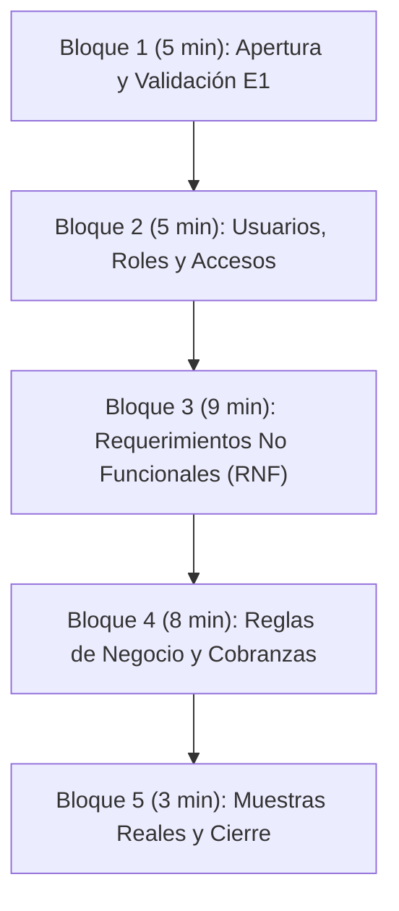

# Entrevista 2 — Guión de Preguntas y Relevamiento de Requerimientos

## 1. Ficha Técnica del Encuentro (Formato Oficial de Cátedra)

- **Proyecto:** Sistema de Gestión Logística, Distribución y Conciliación de Cobranzas
- **Empresa Consultora:** **Softech**
- **Fase del Proyecto:** Relevamiento de Requerimientos y Definición de Alcance (Previo a Entrega 1 y Demo 1)
- **Modalidad / Lugar:** **Virtual por Discord** (Llamada en servidor de la materia con `@ruso`)
- **Fecha y Hora:** Lunes 14 de Septiembre de 2026 — 17:00 hs
- **Duración prevista:** **30 minutos**
- **Entrevistado:** Martín Rodríguez (`@ruso` en rol de Responsable de Planificación Logística y Hojas de Ruta)
- **Documentos de referencia previa:**
  - Minuta ejecutiva: `Resumen_Entrevista1.pdf` (enviado en `Entrevista1.zip`)
  - Audio de respaldo: `Audio_Entrevista1.m4a`
  - Plantilla base de entrevista: `Entrevista - Plantilla.pdf`
- **Objetivos de la entrevista:**
  1. Validar el flujo operativo relevado y afinar los límites del sistema.
  2. Extraer los **Requerimientos No Funcionales (RNF)** con métricas cuantitativas para la **Entrega 1 (21/09)**.
  3. Profundizar en las reglas de negocio de cobranzas, excepciones y hojas de ruta.
  4. Acordar el alcance prioritario del MVP para la **Demo 1 (30/10)**.
  5. Solicitar una hoja de ruta de muestra y coordinar el envío de un cuestionario complementario.

---

## 2. Pautas Operativas para el Equipo Softech en Discord

> [!IMPORTANT]
> - **Identidad estricta:** Hablamos 100% como **Softech** frente a Martín. No se menciona "Grupo 7", ni número de grupo, ni materias ni profesores.
> - **Manejo de pedidos fuera de alcance:** Si Martín sugiere una funcionalidad compleja (ej. rastreo satelital por GPS en vivo, ruteo automático por IA o integraciones bancarias automáticas), no contradecirlo de forma tajante; responder: *«Perfecto Martín, lo dejamos registrado como una ampliación para una fase posterior, priorizando ahora el núcleo operativo de entregas y conciliación»*.
> - **Roles en la llamada:**
>   - **Moderador / Interlocutor:** Conduce el orden de los bloques y lee las preguntas de forma fluida y natural, cuidando los tiempos (30 min en total).
>   - **Transcriptores (en simultáneo):** Completan el campo `[Respuesta:]` debajo de cada pregunta en este mismo archivo o en sus notas compartidas.

---

## 3. Estructura y Distribución de Tiempos (30 Minutos en Total)

---

## 4. Cuerpo de la Entrevista

### Bloque 1: Apertura, Validación Rápida y Límites del Sistema (5 minutos)

*Objetivo: Validar que la minuta de la Entrevista 1 refleja la realidad y confirmar desde dónde hasta dónde opera el software.*

#### 1.1. Recepción y revisión de la Minuta E1
> *«Buenas tardes Martín, gracias nuevamente por tu tiempo. ¿Pudiste darle una mirada al resumen y al audio que te enviamos por acá? ¿Considerás que refleja con fidelidad lo conversado en nuestro primer encuentro o hay algún detalle que quieras precisar?»*

- **[Respuesta:]**

#### 1.2. Punteo rápido de confirmación dimensional
> *«Retomando con lo discutido en la primera entrevista, tomamos como referencia operativa: 35 partidos de la zona sur, 6 centros de acopio, una flota de 200 camiones, un equipo de 300 transportistas y 10 empleados administrativos dedicados a rutas y conciliación. ¿Hasta ahí vamos bien?»*

- **[Respuesta:]**

#### 1.3. Punto de inicio del sistema en la cadena logística
> *«Respecto a la logística: el sistema que vamos a desarrollar, ¿comienza a operar desde que la mercadería ya se encuentra en el centro de acopio y se diagraman las salidas a los comercios barriales (última milla), o necesitan registrar también el traslado previo desde las fábricas de las marcas matrices hacia el depósito?»*

- **[Respuesta:]**

#### 1.4. Exclusiones confirmadas de alcance
> *«Revalidamos que los comercios minoristas y los clientes finales no van a tener acceso directo al sistema (solo interactúan con el chofer en el mostrador) y que el remito físico en papel se conserva de manera legal obligatoria. ¿Es así?»*

- **[Respuesta:]**

#### 1.5. Modificaciones con respecto a lo charlado previamente
> *«Con esto terminamos de sintetizar lo que charlamos previamente. ¿Hay algo que quieras modificar o agregar antes de pasar al resto de las preguntas?»*

- **[Respuesta:]**

#### 1.6. Cierre de la idea inicial
> *«Perfecto Martín. Te comentamos lo que pensamos implementar hasta el momento:* 
>  - *una plataforma móvil para transportistas en la cual se puedan agregar la información y documentaciones correspondientes a cada entrega, incluyendo dirección del comercio, foto de remito firmado y factura, y donde se pueda cargar los datos de pago.*
>  - *una plataforma de escritorio para la parte administrativa en la que puedan cargar los datos que necesiten los transportistas (cada entrega con su hoja de ruta y demás)».*

- **[Respuesta:]**

---

### Bloque 2: Usuarios, Roles y Plataformas de Acceso (5 minutos)

*Objetivo: Tipificar los perfiles de usuario, definir desde qué dispositivos ingresan y los controles de acceso.*

#### 2.1. Tipos de roles en la empresa
> *«Nosotros identificamos principalmente dos roles operativos: el **Transportista** (en calle) y el **Personal Administrativo** (en base). ¿Existe algún otro rol que deba contemplar el sistema, por ejemplo un Supervisor de depósito, Jefe de logística o un Administrador general del sistema con permisos especiales?»*

- **[Respuesta:]**

#### 2.2. Plataformas de acceso por rol
> *«¿Está previsto que el personal administrativo trabaje exclusivamente desde computadoras de escritorio / notebooks en el centro de acopio, y que los transportistas utilicen exclusivamente la aplicación en sus teléfonos celulares durante el reparto?»*

- **[Respuesta:]**

#### 2.3. Unicidad de cuentas y altas/bajas de personal
> *«Dado que hay rotación de choferes y vehículos: ¿cada transportista debe tener un usuario único e intransferible (para evitar confusiones de quién cobró qué dinero)? ¿El panel administrativo debe permitir dar de alta, pausar o deshabilitar rápidamente a un chofer o camión?»*

- **[Respuesta:]**

---

### Bloque 3: Requerimientos No Funcionales (RNF) (9 minutos)

*Objetivo: Extraer métricas técnicas medibles para la plantilla SRS de la Entrega 1.*

#### 3.1. RNF de Dispositivos, Plataforma e Interfaces de Hardware
> *«Los celulares que usan los 300 transportistas, ¿son equipos personales de cada uno o los provee la empresa? ¿Son todos con sistema Android? ¿Debemos considerar compatibilidad con teléfonos de gama media o modelos más antiguos?»*

- **[Respuesta:]**

#### 3.2. RNF de Rendimiento, Concurrencia y Capacidad
> **3.2.1 (Horarios pico):** *«¿En qué franja horaria se concentra el mayor uso simultáneo del sistema? ¿A primera hora de la mañana (4:00 a 9:00 AM) para descargar las hojas de ruta, o por la tarde (14:00 a 18:00 hs) cuando los camiones van terminando las entregas y rinden las cobranzas?»*

- **[Respuesta:]**

> **3.2.2 (Volumen diario):** *«En un día de alta demanda, ¿cuántos remitos y cobros individuales estima que se gestionan en total entre los 200 camiones? (¿Un promedio de 25 a 35 paradas por camión, es decir unas 5.000 a 7.000 entregas diarias)?»*

- **[Respuesta:]**

#### 3.3. RNF de Seguridad, Auditoría y Resguardo Legal
> **3.3.1 (Auditoría de arqueos y ajustes):** *«Cuando la administración revisa las cobranzas al final del día y encuentra una diferencia de dinero que debe corregirse manualmente: ¿el sistema debe exigir un motivo obligatorio y dejar registrado qué usuario hizo el cambio, en qué fecha y el valor anterior?»*

- **[Respuesta:]**

> **3.3.2 (Conservación de fotos de remitos):** *«Sabemos que el remito físico de papel se archiva durante 5 años por disposiciones legales. En cuanto a las fotos digitales de los remitos que se suban al sistema, ¿cuánto tiempo como mínimo necesitan que se conserven accesibles en los servidores?»*

- **[Respuesta:]**

#### 3.4. RNF de Usabilidad e Identidad Visual
> **3.4.1 (Usabilidad en calle):** *«Considerando que los choferes operan en la vía pública, muchas veces apurados o bajo pleno sol: ¿prefieren una interfaz de alto contraste, con botones grandes y tipografías claras que requiera la menor cantidad posible de toques en pantalla?»*

- **[Respuesta:]**

> **3.4.2 (Imagen de marca):** *«¿Existe alguna paleta de colores institucional, logotipo o lineamiento gráfico corporativo que debamos incorporar en el diseño visual de las pantallas?»*

- **[Respuesta:]**

---

### Bloque 4: Reglas de Negocio, Cobranzas y Flujo de Entrega (8 minutos)

*Objetivo: Despejar todas las dudas funcionales sobre la hoja de ruta, los medios de pago, el remito y las excepciones.*

#### 4.1. Hoja de Ruta y Datos Visibles
> **4.1.1 (Formato de carga):** *«¿En qué formato confecciona hoy la administración las hojas de ruta? (¿Planillas Excel, archivos de texto, o se cargan manualmente parada por parada?)»*

- **[Respuesta:]**

> **4.1.2 (Orden de paradas):** *«Confirmamos que el orden de las paradas es de libre criterio para el chofer según el tránsito y su experiencia barrial. ¿Estamos de acuerdo / Seguimos en la misma línea?»*

- **[Respuesta:]**

> **4.1.3 (Datos en pantalla):** *«En la pantalla de cada parada: entendemos que el chofer no necesita ver el detalle fino ítem por ítem de mercadería en la app (eso ya está en el remito papel), sino los datos clave: Nombre del comercio, Dirección, Importe a cobrar y Medio de pago previsto. ¿Es correcto o necesita algún dato adicional?»*

- **[Respuesta:]**

#### 4.2. Validación del Remito (Físico vs Digital)
> *«Sobre el remito: ¿el transportista debe consultar algún remito digital en la aplicación antes de entregar, o la app simplemente le pide tomar la fotografía del remito en papel una vez que el comerciante lo firmó y selló físicamente?»*

- **[Respuesta:]**

#### 4.3. Circuito de Cobranzas y Arqueo (El Cuello de Botella)
> **4.3.1 (Cobro en Efectivo):** *«Al cobrar en efectivo, el chofer recibe el dinero en mano. En la aplicación, ¿simplemente tipea el importe que efectivamente cobró? Al terminar su jornada en el centro logístico, ¿entrega el dinero físico a un cajero/administrativo para que lo cuente y lo compare contra la app?»*

- **[Respuesta:]**

> **4.3.2 (Cobro por Transferencia Bancaria):** *«Cuando un comercio abona por transferencia, entendemos que transfiere a una cuenta bancaria central de la distribuidora, ¿es así?. Para acreditar que pagó, ¿el chofer debe subir una foto del comprobante de transferencia bancaria, o tipear el código de operación / número de transferencia?»*

- **[Respuesta:]**

> **4.3.3 (Pagos combinados y diferencias de cambio):** *«¿Ocurre que un cliente pague una parte en efectivo y otra por transferencia? ¿O que pague con una pequeña diferencia (por falta de cambio)? ¿Cómo debe registrarlo el chofer y qué tratamiento se le da a ese saldo?»*

- **[Respuesta:]**

> **4.3.4 (Cobro con QR / MODO / Mercado Pago):** *«Mencionaste la proyección de cobrar con QR a futuro. Para esta etapa, ¿la app debe contar con un botón que genere o muestre el alias/QR de la cuenta correspondiente para que el comerciante escanee y el chofer confirme el pago? Nosotros pensábamos en que lleve impreso un QR fijo y el alias.»*

- **[Respuesta:]**

> **4.3.5 (Alertas en el panel de conciliación):** *(Bifurcación solo en caso de tener el rol de administrativos)*  
> *«Para los 10 administrativos que realizan el cuadre: ¿el sistema debe emitir alertas visuales automáticas cuando el dinero rendido por un transportista no coincida exactamente con la suma de los remitos entregados?»*

- **[Respuesta:]**

---

### Bloque 5: Muestras Reales, Cuestionario y Cierre (3 minutos)

*Objetivo: Obtener insumos documentales para Entrega 1 y formalizar la despedida.*

#### 5.1. Solicitud de documentación física de muestra
> *«Para asegurar que el diseño de nuestras pantallas y la base de datos se ajusten a su documentación real: ¿sería posible que nos faciliten una fotografía o copia anonimizada (con los nombres o datos sensibles tachados) de una **hoja de ruta real de un día típico**»*

- **[Respuesta:]**

#### 5.2. Cuestionario complementario para transportistas
> *«Para la próxima entrega documental debemos acompañar el relevamiento con un breve cuestionario estructurado dirigido a relevar hábitos de uso de celulares y cobros entre transportistas (y si corresponde, administrativos). ¿Te parecería bien si luego te enviamos el cuestionario para que nos des tu visto bueno antes de aplicarlo?»*

- **[Respuesta:]**

#### 5.3. Cierre y agradecimiento formal
> *«Muchísimas gracias Martín por tu tiempo y por la claridad en cada punto. Estaremos procesando estas definiciones para volcarlas en la documentación y te haremos llegar la minuta ejecutiva de esta reunión por nuestra vía de contacto habitual. ¡Que tengas muy buena tarde!»*

- **[Respuesta:]**

---

## 5. Conclusiones y Cierre de la Entrevista (Post-Reunión)

*(A completar por el equipo Softech inmediatamente al finalizar la llamada de Discord para el informe final de la Entrega 1)*

### Informe Final y Resumen Ejecutivo
- **Síntesis del encuentro:** 
- **Decisiones críticas tomadas:** 

### Información Obtenida en Detalle
- **Requerimientos No Funcionales confirmados:** 
- **Reglas de negocio y excepciones validadas:** 
- **Alcance acordado para la Demo 1:** 

### Información Pendiente / Puntos a Profundizar Asincrónicamente
- 

### Documentos que debe entregar el entrevistado (Martín)
- [ ] Foto/copia de hoja de ruta real anonimizada.

### Documentos que debe entregar Softech
- [ ] Minuta y resumen formal de la Entrevista 2 (vía Discord).
- [ ] Borrador del Cuestionario para validación.

---

**Softech — Consultoría y Soluciones de Software**  
*Registro de Entrevista 2 — Septiembre 2026*
