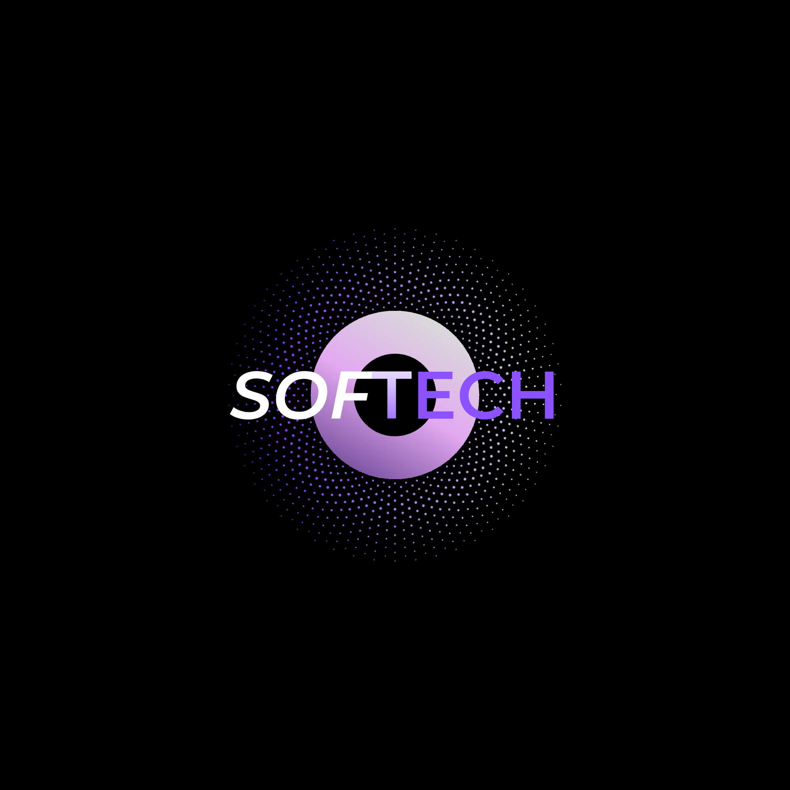

<p align="center">
  
</p>

<h1 align="center">Sistema de Gestión Logística y Distribución</h1>

<p align="center">
  <strong>Proyecto de Cátedra — Ingeniería de Software</strong><br>
  Facultad de Informática — Universidad Nacional de La Plata (UNLP)<br>
  <em>Equipo de Desarrollo: Softech</em>
</p>

---

## 📌 Acerca del Proyecto

Este repositorio contiene la ingeniería de requisitos, documentación de diseño arquitectónico y el desarrollo del software para la optimización de procesos operativos, gestión de pedidos y circuito de cobranzas de un **centro de distribución logística tercerizada**.

### Contexto del Negocio y Cliente
- **Stakeholder / Cliente:** Martín Rodríguez (Responsable de Planificación Logística y Rutas).
- **Actividad:** Operador logístico tercerizado para grandes marcas de consumo masivo y bebidas (ej. Coca-Cola).
- **Escala de Operación:** 35 partidos de la zona sur del Gran Buenos Aires, 6 centros logísticos de acopio, flota de 200 camiones (170-180 activos diarios), 300 transportistas y 10 empleados administrativos en base.
- **Canal destinatario:** Comercio minorista tradicional de cercanía (kioscos, almacenes y autoservicios de proximidad). Se excluyen cadenas de hipermercados.
- **Desafío central (El Dolor del Negocio):** El cuello de botella no radica en WhatsApp, sino en el **arqueo diario y conciliación de cobranzas**. La atomización en miles de microcobros diarios (efectivo, transferencias, QR) por cuenta y orden de múltiples marcas hace que el cuadre manual en papel sea lento, extenuante y propenso a desfasajes con los proveedores.

---

## 👥 Integrantes — Equipo Softech

El equipo está conformado por **7 integrantes**:

- **Enzo Giandon**
- **Alan Tolaba**
- **Catalina Caruso**
- **Ian Chica Herrero**
- **Lautaro Giralde**
- **Mayerly Sinion Mendoza**
- **Aylén Carlos**

---

## 📂 Estructura del Repositorio

La organización del proyecto sigue una estricta separación de responsabilidades para garantizar mantenibilidad tanto en la etapa documental como en la fase de implementación:

```text
Proyecto_Ing-software/
├── assets/                             # Identidad visual y recursos gráficos
│   └── logos/                          # Logotipos oficiales de Softech
├── docs/                               # Documentación de ingeniería y gestión
│   ├── entregas/                       # Paquetes formales de entregas para la cátedra
│   │   ├── README.md                   # Resumen del estado de entregas del cuatrimestre
│   │   ├── entrega-01/                 # Entrevistas + Cuestionario + Req. no funcionales (Finalizada)
│   │   └── entrega-02/                 # Iniciativas + Épicas + HU (Taiga) + PGP (En desarrollo)
│   ├── entrevistas/                    # Ciclo de entrevistas y relevamiento de campo
│   │   ├── README.md                   # Resumen del ciclo y accesos a audios en la nube
│   │   ├── entrevista-01/              # Relevamiento operativo y modelo de negocio
│   │   └── entrevista-02/              # Requisitos de software y circuito financiero
│   └── gestion/                        # Minutas internas, debates de equipo y pautas metodológicas
│       ├── notas-preparacion.md        # Apuntes de preparación metodológica
│       ├── debate-entrevistas.md       # Acuerdos y dinámicas grupales
│       └── comunicacion-kristian.md    # Registro de comunicaciones
└── src/                                # Código fuente del sistema (en desarrollo)
```

---

## 🚀 Estado del Proyecto y Hoja de Ruta

- [x] **Fase 1: Relevamiento y Validación Operativa (Entrevistas 1 y 2 — Entrega 1)**
  - Relevamiento de infraestructura, flota de camiones, centros de acopio y perfil de clientes.
  - Validación del circuito de cobranzas multimarca, reglas de entrega y RNF.
- [ ] **Fase 2: Especificación Ágil y Planificación (Entrega 2 - En Progreso)**
  - Definición de 3 Iniciativas y 9 Épicas funcionales.
  - Backlog de 30 a 40 Historias de Usuario (HU) en Taiga con criterios de aceptación narrativos.
  - Plan de Gestión del Proyecto (PGP) y matriz de roles.
- [ ] **Fase 3: Diseño de Arquitectura y Prototipado UX/UI**
- [ ] **Fase 4: Implementación del Sistema (Frontend & Backend)**

---

## 📄 Licencia y Uso Académico

Documentación y código desarrollados con fines exclusivamente académicos en el marco de la carrera de Ingeniería en Computación de la UNLP.
